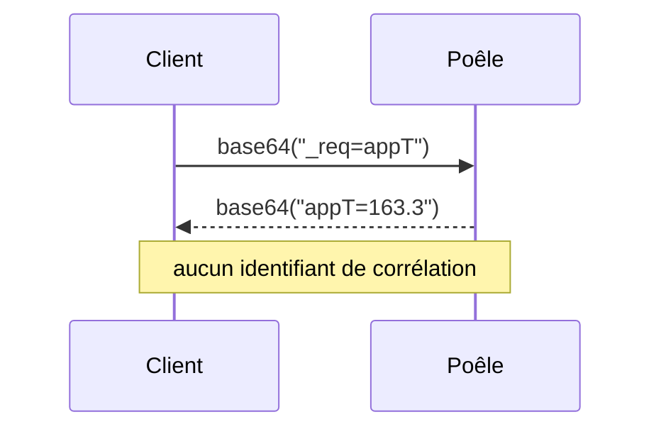

# Protocole WebSocket des poêles Hase iQ (génération flamemonitor)

Spécification reconstituée par **observation du dialogue réseau** entre l'application
`flamemonitor` et un poêle Hase iQ, sur le réseau local de l'auteur. Aucun micrologiciel n'a
été décompilé, aucune clé ni aucun binaire du fabricant n'a été extrait.

> ⚠️ **Deux générations de poêles portent le nom « Hase iQ ».** Celle décrite ici est
> l'ancienne, pilotée par l'application **`flamemonitor`**. La nouvelle, pilotée par
> l'application **`HASE iQ`**, n'a pas été observée et n'est pas couverte par ce document.

## Statut des affirmations

Chaque point porte l'un de ces statuts. **Ne jamais coder sur la foi d'un point ❓.**

| | signification |
|---|---|
| ✅ | validé : observé dans les captures **et** vérifié par le code qui tourne |
| 🟡 | partiel : observé dans les captures, l'interprétation reste une lecture raisonnable |
| ❓ | supposé : trop peu d'observations pour conclure |

---

## Transport ✅

Le poêle expose un serveur **WebSocket non chiffré** sur le port `8080`.

```
ws://<ip-du-poele>:8080
```

Ni authentification, ni jeton, ni en-tête particulier : toute machine du réseau local peut
ouvrir la connexion. C'est une raison de plus de ne pas exposer le poêle hors du LAN.

## Cadre du dialogue ✅

Une trame envoyée, exactement une trame reçue. **Le poêle ne parle jamais de lui-même** : il
n'émet rien tant qu'on ne lui demande rien, et n'envoie aucune notification.



Rien dans la réponse ne permet de la rattacher à sa requête autrement que par **l'ordre**, et
par le nom que le poêle répète en tête de sa réponse. Deux requêtes en vol simultanément
seraient donc indistinguables : le dialogue doit être **strictement sérialisé**. C'est ce que
fait `Client` avec un verrou, et la bibliothèque `websockets` refuse de toute façon deux `recv`
concurrents sur la même connexion.

## Encodage des trames ✅

Les trames sont **textuelles** et **encodées en base64**, dans les deux sens.

| sens | contenu avant encodage |
|---|---|
| client → poêle | `_req=<nom>` |
| poêle → client | `<nom>=<valeur>` |

```
"_req=appPhase"  ->  "X3JlcT1hcHBQaGFzZQ=="
"appPhase=2"     ->  "YXBwUGhhc2U9Mg=="
```

> ⚠️ **La valeur peut contenir un `=`.** `_oemver` répond `_oemver=AAF_5815=9`. Seul le
> premier `<nom>=` est un préfixe ; il se retire avec un `removeprefix`, **jamais** avec un
> `lstrip`, qui prend un *ensemble de caractères* et mangerait le début de la valeur.

## Écriture : aucune commande connue ✅

**Aucune des trames observées n'écrit quoi que ce soit sur le poêle.** Toutes commencent par
`_req=` et se contentent de lire. L'application `flamemonitor` n'offre d'ailleurs aucun
réglage : elle affiche, elle ne commande pas.

Rien ne prouve qu'un tel verbe n'existe pas dans le micrologiciel — seulement qu'aucun n'a été
observé, et qu'aucun n'est cherché. `pyhaseiq` est **en lecture seule par construction** et le
reste : voir les interdits de [`CONTRIBUTING.md`](../CONTRIBUTING.md).

---

## Table des requêtes

Les valeurs ci-dessous sont celles réellement observées dans [`records/`](../records/), sur
cinq captures couvrant les phases 0 à 3.

| requête | valeur observée | phases où l'app l'envoie | statut | interprétation |
|---|---|---|---|---|
| `appPhase` | `0`, `1`, `2`, `3` | toutes | ✅ | phase de fonctionnement, voir plus bas |
| `appT` | `32.3` → `163.3` | 1 | ✅ | température dans le foyer, en °C |
| `appAufheiz` | `2.4` → `53.5` | 1 | 🟡 | progression de la montée en chauffe, en % |
| `appP` | `61` → `69` | 2 | 🟡 | indice de performance de la combustion, en % |
| `appErr` | `0` | toutes | 🟡 | code d'erreur ; jamais vu autre chose que `0` |
| `appNach` | `0` | 2 | ❓ | *nach* = « après » en allemand ; toujours `0` |
| `_l1h` | `(?)` | 3 | ❓ | réponse littéralement `(?)`, sens inconnu |
| `_oemdev` | `2` | toutes | 🟡 | identifiant de modèle ou de famille |
| `_oemver` | `AAF_5815=9` | toutes | 🟡 | version du micrologiciel constructeur |
| `_wversion` | `1.4` | toutes | 🟡 | version de l'interface web embarquée |
| `appPTx` | `1`, `2`, `13`, `19`, `60` | toutes | 🟡 | nombre de points de la série de la flambée en cours |
| `appPT[a;b]` | `9;5;6;6;5;…` | 1, 2, 3 | 🟡 | points `a` à `b` de cette série |
| `appPT[a]` | `0`, `13` | 1 | 🟡 | le seul point `a` |
| `appP30Tx` | `30` | 0, 1, 3 | 🟡 | taille de la série longue : toujours `30` |
| `appP30T[a;b]` | `46;46;45;45;…` | toutes | 🟡 | points `a` à `b` de la série longue |

### Ce que « phases où l'app l'envoie » veut dire ❓

L'application `flamemonitor` n'interroge `appT` et `appAufheiz` qu'en phase 1, et `appP` qu'en
phase 2. **On ignore si le poêle répond quand même hors de ces phases**, ou s'il reste muet :
l'application ne demande simplement pas, donc aucune capture ne tranche.

C'est une inconnue de conséquence pratique : une requête restée sans réponse bloque l'appelant
jusqu'à son délai d'attente. `demo.py` s'aligne donc sur l'application et ne demande une mesure
que dans la phase où elle est attendue. Un appelant qui sort de ce cadre doit prévoir un
`ResponseTimeoutError`.

---

## `appPhase` — phase de fonctionnement

| valeur | nom dans `pyhaseiq` | signification | statut |
|---|---|---|---|
| `0` | `Phase.IDLE` | pas de feu, le poêle attend | ✅ |
| `1` | `Phase.HEATING_UP` | feu en cours, la température monte | ✅ |
| `2` | `Phase.NOMINAL` | température nominale atteinte | ✅ |
| `3` | `Phase.NEEDS_WOOD` | il faut recharger en bois | ✅ |
| `4` | `Phase.BURNING_OUT` | le feu s'éteint, ne plus ajouter de bois | ❓ |

La phase `4` **n'apparaît dans aucune capture** : elle vient de la documentation du poêle. Sa
valeur numérique est cohérente avec la suite, mais rien ne la confirme.

`Client.get_phase()` lève `ProtocolError` sur toute autre valeur, plutôt que de rendre un
entier qu'un appelant interpréterait de travers.

## `appAufheiz` — montée en chauffe 🟡

Sur les 72 couples `(appT, appAufheiz)` relevés pendant la montée, la relation est quasi
affine :

```
appAufheiz ≈ 0,434 × appT − 11,5      (R² = 0,992)
```

Extrapolée, elle donne `0 %` vers **27 °C** — soit la température ambiante — et `100 %` vers
**257 °C**, un ordre de grandeur cohérent avec la température nominale d'un foyer. La lecture
« pourcentage de progression vers la température nominale » tient donc.

Le `R²` reste toutefois sous `1` : ce n'est **pas** exactement une fonction de la seule
température instantanée. Le poêle y mêle probablement une moyenne ou une intégrale. Ne pas
recalculer `appAufheiz` à partir de `appT`.

## `appPT` et `appP30T` — séries de mesures 🟡

Deux séries, interrogées de la même façon : un compteur `…x` donne le nombre de points, puis
`…[a;b]` renvoie les points `a` à `b`, séparés par des `;`.

| | compteur | valeur du compteur | lecture |
|---|---|---|---|
| série courante | `appPTx` | varie : `1`, `2`, `13`, `19`, `60` | `appPT[0;14]` |
| série longue | `appP30Tx` | toujours `30` | `appP30T[0;14]`, `appP30T[15;29]` |

`appPTx` **grandit au fil de la flambée** — `1` puis `2` au tout début de la montée, `13` en
milieu de montée, `19` puis `60` en phase nominale : la série s'allonge avec le feu en cours.
`appP30Tx` vaut toujours `30`, d'où le `30` dans son nom : un historique de taille fixe, que
l'application lit en deux moitiés de 15 points.

Exemple, en phase 0 :

```
appP30T[15;29] = 41;40;40;40;40;39;39;39;39;39;38;38;38;70;13
```

La décroissance régulière évoque un refroidissement, mais **l'unité et le pas de temps sont
inconnus**, et les dernières valeurs (`70`, `13`, `9`, `21` selon les captures) rompent la
courbe sans explication. Ces séries ne sont pour cette raison **pas exposées** par une méthode
typée ; elles restent accessibles via `Client.get("appP30T[15;29]")`.

---

## Méthode

Les captures de [`records/`](../records/) ont été produites ainsi, une par phase.

1. Capturer le trafic entre le téléphone et le poêle pendant que `flamemonitor` tourne.
   Dans les captures, `192.168.1.115` est le téléphone et `192.168.1.165` le poêle.
2. Ouvrir la capture dans Wireshark et appliquer ce filtre, qui écarte les trames de contrôle
   `ping`/`pong` (opcodes 9 et 10) :

   ```
   (ip.src == 192.168.1.165 or ip.dst == 192.168.1.165) and websocket
     and !(websocket.opcode == 9 or websocket.opcode == 10)
   ```

3. Exporter : `File` > `Export Packet Dissections` > `As JSON`.
4. Décoder l'export :

   ```bash
   uv run records/extract.py records/<export>.json
   ```

   Le script écrit `<export>.json.parsed.json`, où chaque paquet devient `{src, dst, ts,
   payload}` avec les charges utiles décodées. Wireshark joint d'un retour chariot les trames
   WebSocket qui partagent un même paquet TCP : le script les resépare.

## Ce qui reste ouvert

- La génération pilotée par l'application `HASE iQ` : protocole inconnu, sans doute différent.
- La phase `4`, jamais observée.
- `appNach` et `_l1h`, constants dans toutes les captures.
- L'unité et le pas de temps des séries `appPT` / `appP30T`.
- Le comportement du poêle face à une requête hors de sa phase : répond-il, ou se tait-il ?
- L'existence d'un éventuel verbe d'écriture — non observé, et non recherché.
