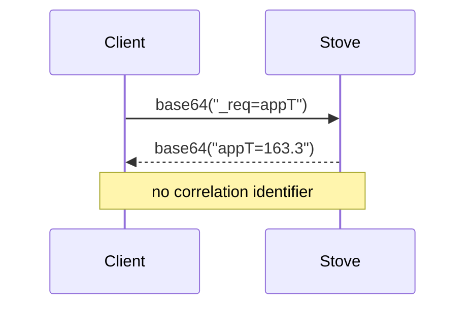

# WebSocket protocol of Hase iQ stoves (flamemonitor generation)

Specification reconstructed by **observing the network dialogue** between the `flamemonitor`
application and a Hase iQ stove, on the author's local network. No firmware was decompiled, and
no manufacturer key or binary was extracted.

> ⚠️ **Two generations of stoves carry the name "Hase iQ".** The one described here is the old
> one, driven by the **`flamemonitor`** application. The new one, driven by the **`HASE iQ`**
> application, has not been observed and is not covered by this document.

## Status of the statements

Every point carries one of these statuses. **Never write code on the strength of a ❓ point.**

| | meaning |
|---|---|
| ✅ | confirmed: observed in the captures **and** verified by running code |
| 🟡 | partial: observed in the captures, the interpretation remains a reasonable reading |
| ❓ | assumed: too few observations to conclude |

---

## Transport ✅

The stove exposes an **unencrypted WebSocket** server on port `8080`.

```
ws://<stove-ip>:8080
```

No authentication, no token, no particular header: any machine on the local network can open
the connection. One more reason not to expose the stove outside the LAN.

## Shape of the dialogue ✅

One frame sent, exactly one frame received. **The stove never speaks on its own**: it emits
nothing until asked, and sends no notification.



Nothing in the answer ties it to its request other than **order**, and the name the stove
repeats at the head of its answer. Two requests in flight at once would therefore be
indistinguishable: the dialogue must be **strictly serialised**. That is what `Client` does with
a lock, and the `websockets` library refuses two concurrent `recv` calls on the same connection
anyway.

## Frame encoding ✅

Frames are **textual** and **base64-encoded**, in both directions.

| direction | content before encoding |
|---|---|
| client → stove | `_req=<name>` |
| stove → client | `<name>=<value>` |

```
"_req=appPhase"  ->  "X3JlcT1hcHBQaGFzZQ=="
"appPhase=2"     ->  "YXBwUGhhc2U9Mg=="
```

> ⚠️ **The value may contain an `=`.** `_oemver` answers `_oemver=AAF_5815=9`. Only the first
> `<name>=` is a prefix; it is stripped with `removeprefix`, **never** with `lstrip`, which
> takes a *set of characters* and would eat into the beginning of the value.

## Writing: no known command ✅

**None of the observed frames writes anything to the stove.** They all start with `_req=` and do
nothing but read. The `flamemonitor` application offers no setting anyway: it displays, it does
not command.

Nothing proves such a verb does not exist in the firmware — only that none was observed, and
that none is being looked for. `pyhaseiq` is **read-only by construction** and stays that way:
see the prohibitions in [`CONTRIBUTING.md`](../CONTRIBUTING.md).

---

## Table of requests

The values below are those actually observed over five captures covering phases 0 to 3. The
captures themselves are not committed: an Ethernet capture carries the **MAC addresses** of the
stove and of the phone, which are permanent hardware identifiers.

| request | observed value | phases where the app sends it | status | interpretation |
|---|---|---|---|---|
| `appPhase` | `0`, `1`, `2`, `3` | all | ✅ | operating phase, see below |
| `appT` | `32.3` → `163.3` | 1 | ✅ | temperature in the firebox, in °C |
| `appAufheiz` | `2.4` → `53.5` | 1 | 🟡 | progress of the heat-up, in % |
| `appP` | `61` → `69` | 2 | 🟡 | combustion performance index, in % |
| `appErr` | `0` | all | 🟡 | error code; never seen as anything but `0` |
| `appNach` | `0` | 2 | ❓ | *nach* = "after" in German; always `0` |
| `_l1h` | `(?)` | 3 | ❓ | answer is literally `(?)`, meaning unknown |
| `_oemdev` | `2` | all | 🟡 | model or family identifier |
| `_oemver` | `AAF_5815=9` | all | 🟡 | manufacturer firmware version |
| `_wversion` | `1.4` | all | 🟡 | version of the embedded web interface |
| `appPTx` | `1`, `2`, `13`, `19`, `60` | all | 🟡 | number of points in the current fire's series |
| `appPT[a;b]` | `9;5;6;6;5;…` | 1, 2, 3 | 🟡 | points `a` to `b` of that series |
| `appPT[a]` | `0`, `13` | 1 | 🟡 | point `a` alone |
| `appP30Tx` | `30` | 0, 1, 3 | 🟡 | size of the long series: always `30` |
| `appP30T[a;b]` | `46;46;45;45;…` | all | 🟡 | points `a` to `b` of the long series |

### What "phases where the app sends it" means ❓

The `flamemonitor` application only queries `appT` and `appAufheiz` in phase 1, and `appP` in
phase 2. **Whether the stove answers anyway outside those phases is unknown**, as is whether it
stays silent: the application simply does not ask, so no capture settles it.

This unknown has a practical consequence: a request left unanswered blocks the caller until its
timeout. `demo.py` therefore follows the application and only asks for a reading in the phase
where it is expected. A caller who steps outside that frame must handle a
`ResponseTimeoutError`.

---

## `appPhase` — operating phase

| value | name in `pyhaseiq` | meaning | status |
|---|---|---|---|
| `0` | `Phase.IDLE` | no fire, the stove is waiting | ✅ |
| `1` | `Phase.HEATING_UP` | fire burning, the temperature is rising | ✅ |
| `2` | `Phase.NOMINAL` | nominal temperature reached | ✅ |
| `3` | `Phase.NEEDS_WOOD` | wood needs to be added | ✅ |
| `4` | `Phase.BURNING_OUT` | the fire is dying down, add no more wood | ❓ |

Phase `4` **appears in no capture**: it comes from the stove's own documentation. Its numeric
value is consistent with the sequence, but nothing confirms it.

`Client.get_phase()` raises `ProtocolError` on any other value, rather than returning an integer
a caller would misinterpret.

## `appAufheiz` — heat-up 🟡

Over the 72 `(appT, appAufheiz)` pairs recorded during the heat-up, the relation is almost
affine:

```
appAufheiz ≈ 0.434 × appT − 11.5      (R² = 0.992)
```

Extrapolated, it gives `0 %` around **27 °C** — i.e. room temperature — and `100 %` around
**257 °C**, an order of magnitude consistent with the nominal temperature of a firebox. The
reading "percentage of progress towards the nominal temperature" therefore holds.

The `R²` nevertheless stays below `1`: this is **not** exactly a function of the instantaneous
temperature alone. The stove probably mixes in an average or an integral. Do not recompute
`appAufheiz` from `appT`.

## `appPT` and `appP30T` — measurement series 🟡

Two series, queried the same way: a `…x` counter gives the number of points, then `…[a;b]`
returns points `a` to `b`, separated by `;`.

| | counter | counter value | read as |
|---|---|---|---|
| current series | `appPTx` | varies: `1`, `2`, `13`, `19`, `60` | `appPT[0;14]` |
| long series | `appP30Tx` | always `30` | `appP30T[0;14]`, `appP30T[15;29]` |

`appPTx` **grows as the fire goes on** — `1` then `2` at the very beginning of the heat-up, `13`
mid heat-up, `19` then `60` in the nominal phase: the series lengthens with the ongoing fire.
`appP30Tx` is always `30`, hence the `30` in its name: a fixed-size history, which the
application reads in two halves of 15 points.

Example, in phase 0:

```
appP30T[15;29] = 41;40;40;40;40;39;39;39;39;39;38;38;38;70;13
```

The steady decline evokes a cooldown, but **the unit and the time step are unknown**, and the
last values (`70`, `13`, `9`, `21` depending on the capture) break the curve without
explanation. For that reason these series are **not exposed** through a typed method; they stay
reachable through `Client.get("appP30T[15;29]")`.

---

## Method

The captures were produced as follows, one per phase. They stay on the maintainer's machine:
see the warning above.

1. Capture the traffic between the phone and the stove while `flamemonitor` is running. In the
   captures, `192.168.1.115` is the phone and `192.168.1.165` the stove.
2. Open the capture in Wireshark and apply this filter, which discards the `ping`/`pong` control
   frames (opcodes 9 and 10):

   ```
   (ip.src == 192.168.1.165 or ip.dst == 192.168.1.165) and websocket
     and !(websocket.opcode == 9 or websocket.opcode == 10)
   ```

3. Export: `File` > `Export Packet Dissections` > `As JSON`.
4. Decode the export:

   ```bash
   uv run tools/extract.py <export>.json
   ```

   The script writes `<export>.json.parsed.json`, where each packet becomes `{src, dst, ts,
   payload}` with the payloads decoded. Wireshark joins with a carriage return the WebSocket
   frames that share a single TCP packet: the script splits them apart again.

## What remains open

- The generation driven by the `HASE iQ` application: unknown protocol, probably different.
- Phase `4`, never observed.
- `appNach` and `_l1h`, constant across every capture.
- The unit and the time step of the `appPT` / `appP30T` series.
- The stove's behaviour when faced with a request outside its phase: does it answer, or stay
  silent?
- The existence of a possible write verb — not observed, and not looked for.
